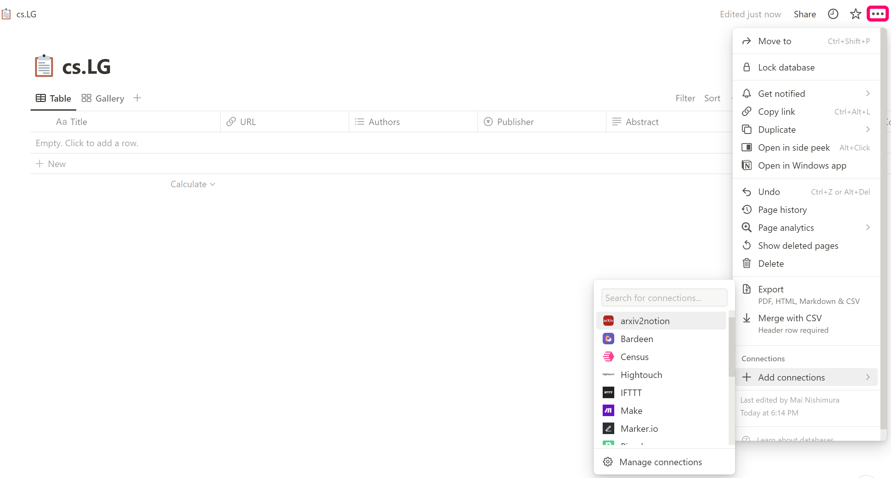

# arxiv2notion
[](https://github.com/denkiwakame/arxiv2notion/actions/workflows/build.yaml) [](https://github.com/denkiwakame/arxiv2notion/actions/workflows/lint.yaml)

Easy-to-use arXiv clipper for [Notion](https://www.notion.so) based on [Notion API](https://developers.notion.com/)


## ⬇️ Installation
### a. Install via Chrome Store
- arxiv2notion is now available at [Chrome Store]().

### b. Install Manually
- download extension package from 
https://github.com/denkiwakame/arxiv2notion/releases/latest
- for Chrome, navigate to `chrome://extension`
  - drag and drop the extension from your file manager anywhere onto the extensions page
  - or unzip the extension and `load unpacked` in developer mode

## ⚙️ Setup

### 1. Add arxiv2notion integration
- follow the instruction of [Notion API](https://developers.notion.com/docs/getting-started)
  - navigate to [My Integrations](https://www.notion.so/my-integrations)
  - `+ New integration`
  - **associated workspace:** select your workspace where you save arXiv articles


### 2. Configure the extension
- right-click on the extension icon > `Options`
  - copy **integration id (not the secret token!)** (see figures below) from `https://hwww.notion.so/my-integrations/internal/${integration-id}`
  - paste the `integration id` and click on `+` button.
  - if your entered id is valid, you can see the following callback messages.

> [!NOTE]
> To enhance security, arxiv2notion retrieves the Notion API key on-demand through integration ID instead of storing it directly in Chrome local storage. **Please ensure you are logged into notion.so while using this extension.**


### 3. Create databases in Notion
#### from template (recommended)
- clone the public template [here](https://denkiwakame.notion.site/597cdd58bded4375b1cbe073b2ed6f5d?v=63fcbfda57824b239b66e52dde841cdf) to your own notion workspace
- add connection to target databases via `...` > `+ Add connections` > `arxiv2notion`



- you can switch multiple DBs by adding the connection to these pages, respectively.


#### or manually
- alternatively, you can follow the following steps to create database from scratch in notion
- login to [notion.so](https://www.notion.so) by admin user
- create databases where you save arXiv articles
  - **follow this instruction** https://www.notion.so/guides/creating-a-database and **add properties listed below.**

> [!CAUTION]
> Do **NOT** create a new database by `/database` !
> Make sure to create properties with **exactly the same names and types as those listed.**

|property|type|
|-----|-----|
|Title|Title|
|URL|URL|
|Authors|Multi-Select|
|Abstract|Text|
|Published|Date|
|Comments|URL|
|Publisher|Select|

> [!NOTE]
> **migration from v0.1.x → v1.0.0**
- We changed `Authors` type and added `Published` `Comments` property from [v1.0.0](https://github.com/denkiwakame/arxiv2notion/releases/tag/v1.0.0).
- Change your existing database properties as follows, you can easily integrate new features to your existing Notion database!

|property|type(^v0.1.x)|type(v1.0.0+) |
|-----|-----|-----|
|Authors|Text| **Multi-Select**|
|**Published**|--|**Date**|
|**Comments**|--|**URL**|

> [!TIP]
> You can add extra columns of your choice alongside the default ones in your databases.

#### :bulb: w/ Notion Formula (optional)
- [Notion Formula](https://www.notion.so/help/formulas) allows you to add **custom autofill property** defined by formula.
- For instance, `replace(URL, "arxiv", "ar5iv")` formula adds an [ar5iv link](https://ar5iv.labs.arxiv.org/) column by substituting "arxiv.org" with "ar5iv.org" 🚀


#### :bulb: w/ Notion AI Property (optional)
- [Notion AI Property](https://www.notion.so/ja-jp/help/guides/5-ai-prompts-to-surface-fresh-insights-from-your-databases) allows you to add **custom autofill property** to each DB record.
- Add column to your Notion DB and select `AI custom autofill`
- Set any prompt you like (e.g. summarization, extracting key ideas ...)
  
- Save an article via `arxiv2notion` ,and then the preset `AI property` will be automatically generated.
  

## :technologist: Build locally (for Developers)
- See also [CONTRIBUTING.md](CONTRIBUTING.md)

```bash
$ git clone https://github.com/denkiwakame/arxiv2notion.git
$ npm install
$ npm run build
$ npm run watch # debug locally
$ npm run pack  # packaging to zip
```

## Contributors
- Maintainers: [@denkiwakame](https://github.com/denkiwakame), [@wangjksjtu](https://github.com/wangjksjtu)
<a href="https://github.com/denkiwakame/arxiv2notion/graphs/contributors">
  
</a>
